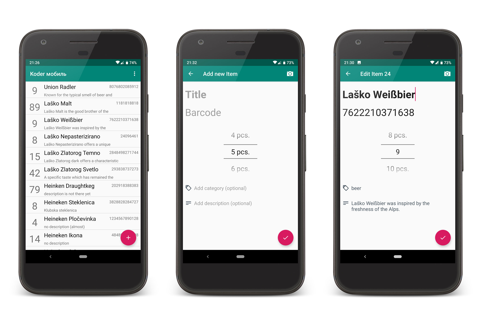

# =kodermobilj=
Android native client for [barkoder](https://github.com/maslick/barkoder)

[](https://travis-ci.org/maslick/kodermobilj)
[](https://codeclimate.com/github/maslick/kodermobilj/maintainability)
[](https://codecov.io/gh/maslick/kodermobilj)
[](https://opensource.org/licenses/MIT)
[](https://dl.bintray.com/maslick/generic/kodermobile/)



## Features
* Scans the product barcode and pushes it to a ``barkoder`` hosted backend
* Simple CRUD operations
* MVP architecture (Kotlin + Koin)
* Protected by Keycloak
* Using OkHttp v3, Retrofit v2, RxJava v2, Koin v1


## Usage
Edit the file ``Config.kt`` according to your setup:
```kt
object Config {
    const val barkoderBaseUrl = "[BARKODER_URL]"
    const val keycloakBaseUrl = "https://[KEYCLOAK_URL]/auth/realms/[REALM]/protocol/openid-connect"
    const val clientId = "[CLIENT_ID]"
    const val authenticationCodeUrl = "$keycloakBaseUrl/auth"
    const val redirectUri = "barkoder://oauthresponse"
}
```
